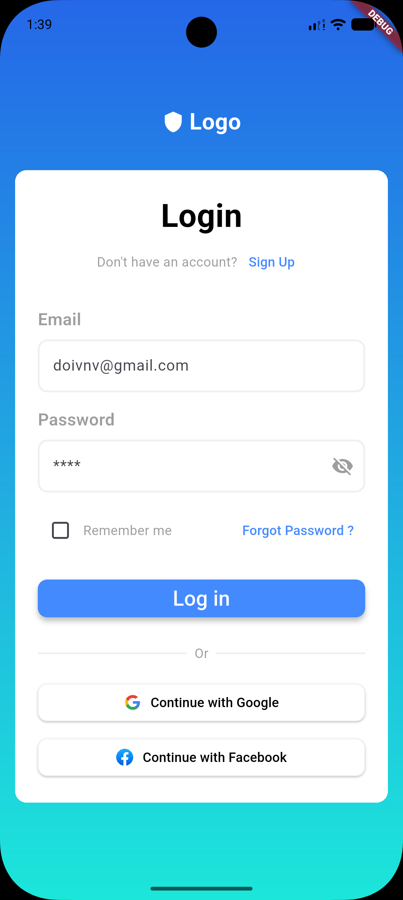
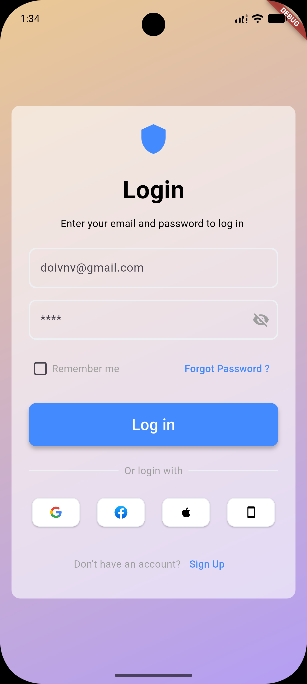
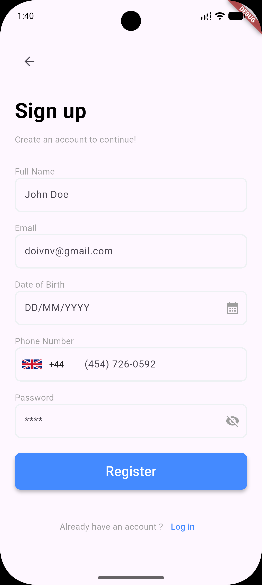
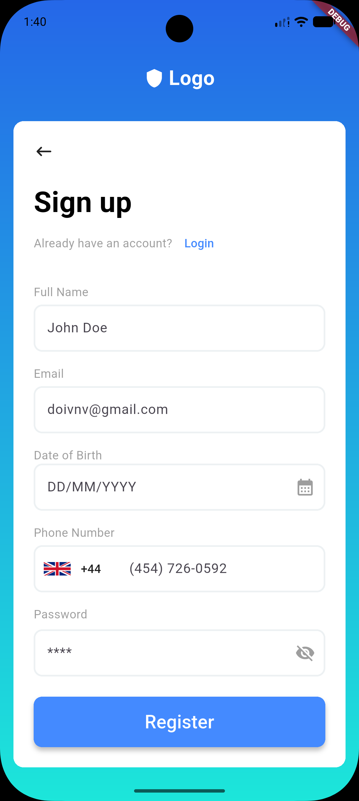
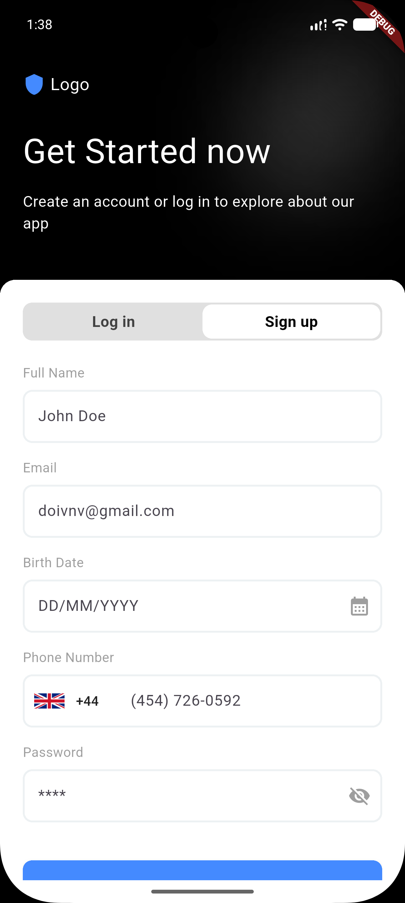
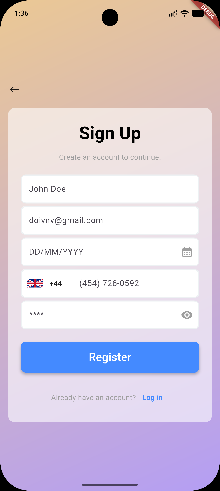

# Flutter Authentication UI Collection

A collection of Flutter authentication screen recreations built for UI practice.

## About

This repository contains multiple login and sign-up screens recreated from UI designs found on the Figma Community. The goal is to improve Flutter layout skills by accurately translating designs into responsive Flutter interfaces.

## Screens

### Login Screen 1

### Login Screen 2

### Login Screen 7

### Login Screen 10

### Sign Up Screen 1

### Sign Up Screen 2

### Sign Up Screen 7

### Sign Up Screen 10

## What I Practiced

* Flutter layouts
* Row & Column
* Stack
* Container decoration
* TextField customization
* Buttons
* Icons
* Asset management

## Technologies

* Flutter
* Dart

## Note

This project focuses on UI implementation only. It does not include backend integration, authentication, state management, or navigation.
